 

 [](https://github.com/btssn-lasalle-84/just-feed-2023/actions/workflows/make-qt.yml) [](https://github.com/btssn-lasalle-84/just-feed-2023/actions/workflows/android-build.yml) [](https://github.com/btssn-lasalle-84/just-feed-2023/actions/workflows/pages/pages-build-deployment)

# Le projet just-feed 2023

- [Le projet just-feed 2023](#le-projet-just-feed-2023)
  - [Documentation du code](#documentation-du-code)
  - [Resources logicielles](#resources-logicielles)
  - [Base de données](#base-de-donn%C3%A9es)
  - [MQTT](#mqtt)
    - [Qt MQTT](#qt-mqtt)
    - [Paho MQTT (Android)](#paho-mqtt-android)
  - [Versions](#versions)
    - [0.2](#02)
    - [0.1](#01)
  - [Auteurs](#auteurs)


---

Le système doit permettre de surveiller à distance des distributeurs automatiques (café, fruits secs, céréales, …) afin d’optimiser le processus de réapprovisionnement.

- Chaque distributeur automatique est équipé de capteurs et d’une carte embarquée (The Things Uno ou modèle équivalent) communiquant via LoRaWan avec un serveur The Things Network. [Étudiants EC]
- Une application **PC Desktop** supervise l’ensemble des distributeurs afin de déterminer leur état d’approvisionnement. Les données sont reçues au format JSON par le protocole MQTT via le réseau _The Things Network_. [Étudiants IR]
- Une application mobile pour **Android** permettra aux opérateurs d’assurer leur intervention (géolocalisation, parcours, type de produits à réapprovisionner, validation de l’intervention, ...). [Étudiant IR]

## Documentation du code

https://btssn-lasalle-84.github.io/just-feed-2023/

## Resources logicielles

- Application _Desktop_ :

| Désignation               | Caractéristiques                     |
| ------------------------- |:------------------------------------:|
| OS Poste de développement | PC sous GNU/Linux Ubuntu 20.04       |
| EDI                       | Qt Creator 4.11.0                    |
| Développement             | Qt 5.12.8 / C++ (GCC 9.3.0, 64 bits) |

- Application _Android_ :

| Désignation               | Caractéristiques                     |
| ------------------------- |:------------------------------------:|
| OS Poste de développement | PC sous GNU/Linux Ubuntu 20.04       |
| EDI                       | Android Studio 2021.3 / Gradle 7.3.1 |
| Développement             | Java (JDK 11.0.13)                   |


## Base de données

Base de données MySQL 8.0 `justfeed` hébergée sur www.db4free.net (pour les tests) :

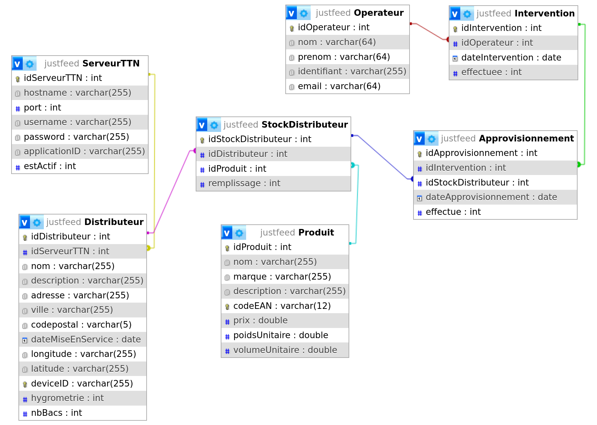

```sql
-- LDD (langage de définition de données)

DROP DATABASE IF EXISTS `justfeed`;

CREATE DATABASE IF NOT EXISTS `justfeed` CHARACTER SET utf8;

--
-- Base de données : `justfeed`
--

USE justfeed;

DROP TABLE IF EXISTS Approvisionnement;
DROP TABLE IF EXISTS Intervention;
DROP TABLE IF EXISTS Bac;
DROP TABLE IF EXISTS Produit;
DROP TABLE IF EXISTS Distributeur;
DROP TABLE IF EXISTS Operateur;
DROP TABLE IF EXISTS ServeurTTN;

--
-- Structure de la table `ServeurTTN`
--

CREATE TABLE `ServeurTTN` (
  `idServeurTTN` int NOT NULL AUTO_INCREMENT PRIMARY KEY,
  `hostname` varchar(255) NOT NULL,
  `port` int NOT NULL DEFAULT '1883',
  `username` varchar(255) DEFAULT NULL,
  `password` varchar(255) DEFAULT NULL,
  `applicationID` varchar(255) NOT NULL,
  `estActif` int DEFAULT '0'
) ENGINE=InnoDB DEFAULT CHARSET=utf8;

--
-- Structure de la table `Operateur`
--

CREATE TABLE `Operateur` (
  `idOperateur` int NOT NULL AUTO_INCREMENT PRIMARY KEY,
  `nom` varchar(64) NOT NULL,
  `prenom` varchar(64) NOT NULL,
  `identifiant` varchar(255) DEFAULT NULL,
  `email` varchar(64) NOT NULL
) ENGINE=InnoDB DEFAULT CHARSET=utf8;

--
-- Structure de la table `Distributeur`
--

CREATE TABLE `Distributeur` (
  `idDistributeur` int NOT NULL AUTO_INCREMENT PRIMARY KEY,
  `idServeurTTN` int NOT NULL,
  `nomDistributeur` varchar(255) DEFAULT NULL,
  `description` varchar(255) DEFAULT NULL,
  `adresse` varchar(255) DEFAULT NULL,
  `ville` varchar(255) DEFAULT NULL,
  `codepostal` varchar(5) DEFAULT NULL,
  `dateMiseEnService` date NOT NULL,
  `longitude` varchar(255) DEFAULT NULL,
  `latitude` varchar(255) DEFAULT NULL,
  `deviceID` varchar(255) NOT NULL,
  `nbBacs` int NOT NULL DEFAULT '2'
) ENGINE=InnoDB DEFAULT CHARSET=utf8;


ALTER TABLE `Distributeur`
  ADD UNIQUE KEY `deviceID` (`deviceID`),
  ADD KEY `Distributeur_fk_1` (`idServeurTTN`);

ALTER TABLE `Distributeur`
  ADD CONSTRAINT `Distributeur_fk_1` FOREIGN KEY (`idServeurTTN`) REFERENCES `ServeurTTN` (`idServeurTTN`) ON DELETE CASCADE;

--
-- Structure de la table `Produit`
--

CREATE TABLE `Produit` (
  `idProduit` int NOT NULL AUTO_INCREMENT PRIMARY KEY,
  `nomProduit` varchar(255) DEFAULT NULL,
  `marque` varchar(255) NOT NULL,
  `description` varchar(255) DEFAULT NULL,
  `codeEAN` varchar(13) DEFAULT NULL,
  `prix` double DEFAULT NULL,
  `poidsUnitaire` double DEFAULT NULL,
  `volumeUnitaire` double DEFAULT NULL
) ENGINE=InnoDB DEFAULT CHARSET=utf8;

ALTER TABLE `Produit`
  ADD UNIQUE KEY `codeEAN` (`codeEAN`);

--
-- Structure de la table `Bac`
--

CREATE TABLE `Bac` (
  `idBac` int NOT NULL AUTO_INCREMENT PRIMARY KEY,
  `idDistributeur` int NOT NULL,
  `idProduit` int NOT NULL,
  `poidsActuel` double,
  `poidsTotal`  double NOT NULL,
  `hygrometrie` int DEFAULT '0',
  `remplissage` double DEFAULT '0'
) ENGINE=InnoDB DEFAULT CHARSET=utf8;

ALTER TABLE `Bac`
  ADD KEY `Bac_fk_1` (`idDistributeur`),
  ADD KEY `Bac_fk_2` (`idProduit`);

ALTER TABLE `Bac`
  ADD CONSTRAINT `Bac_fk_1` FOREIGN KEY (`idDistributeur`) REFERENCES `Distributeur` (`idDistributeur`) ON DELETE CASCADE,
  ADD CONSTRAINT `Bac_fk_2` FOREIGN KEY (`idProduit`) REFERENCES `Produit` (`idProduit`) ON DELETE CASCADE;

--
-- Structure de la table `Intervention`
--

CREATE TABLE `Intervention` (
  `idIntervention` int NOT NULL AUTO_INCREMENT PRIMARY KEY,
  `idOperateur` int NOT NULL,
  `idDistributeur` int NOT NULL,
  `dateIntervention` date NOT NULL,
  `aRemplir` int DEFAULT '0',
  `aDepanner` int DEFAULT '0',
  `etat` enum('EN_COURS','VALIDEE','A_FAIRE') NOT NULL DEFAULT 'A_FAIRE'
) ENGINE=InnoDB DEFAULT CHARSET=utf8;

ALTER TABLE `Intervention`
  ADD KEY `Intervention_fk_1` (`idOperateur`),
  ADD KEY `Intervention_fk_2` (`idDistributeur`);

ALTER TABLE `Intervention`
  ADD CONSTRAINT `Intervention_fk_1` FOREIGN KEY (`idOperateur`) REFERENCES `Operateur` (`idOperateur`) ON DELETE CASCADE;

ALTER TABLE `Intervention`
  ADD CONSTRAINT `Intervention_fk_2` FOREIGN KEY (`idDistributeur`) REFERENCES `Distributeur` (`idDistributeur`);

--
-- Structure de la table `Approvisionnement`
--

CREATE TABLE `Approvisionnement` (
  `idApprovisionnement` int NOT NULL AUTO_INCREMENT PRIMARY KEY,
  `idIntervention` int NOT NULL,
  `idBac` int NOT NULL,
  `poidsAPrevoir` float NOT NULL,
  `heureApprovisionnement` time NOT NULL,
  `effectue` int DEFAULT '0'
) ENGINE=InnoDB DEFAULT CHARSET=utf8;

ALTER TABLE `Approvisionnement`
  ADD KEY `Approvisionnement_fk_1` (`idIntervention`),
  ADD KEY `Approvisionnement_fk_2` (`idBac`);

ALTER TABLE `Approvisionnement`
  ADD CONSTRAINT `Approvisionnement_fk_1` FOREIGN KEY (`idIntervention`) REFERENCES `Intervention` (`idIntervention`) ON DELETE CASCADE,
  ADD CONSTRAINT `Approvisionnement_fk_2` FOREIGN KEY (`idBac`) REFERENCES `Bac` (`idBac`) ON DELETE CASCADE;
```

## MQTT

Voir aussi : [modules-lora/README.md](modules-lora/README.md)

### Qt MQTT

[Qt MQTT](https://doc.qt.io/QtMQTT/index.html) fournit une implémentation conforme à la norme MQTT.

Qt MQTT fait parti de [Qt For Automation](http://doc.qt.io/QtForAutomation/qtautomation-overview.html) et pas directement de Qt. Il faut donc l'installer.

Installation :

1. Identifier la version de Qt :

```sh
$ qmake -v
QMake version 3.1
Using Qt version 5.12.8 in /usr/lib/x86_64-linux-gnu
```

Ici, la version de Qt est `5.12.8`.

2. Récupérer le code source du module `mqtt` en clonant le dépôt git

```sh
$ sudo git clone https://code.qt.io/qt/qtmqtt.git
$ cd qtmqtt/
```

3. Sélectionner la branche qui correspond à la version de Qt utilisée

```sh
$ sudo git checkout 5.12.8
```

4. Installer le paquet fournissant les fichiers d'en-tête de développement indépendants

```sh
$ sudo apt install qtbase5-private-dev
```

5. Fabriquer et installer le module `mqtt`

```sh
$ sudo qmake

$ sudo make

$ sudo make install
```

Pour accèder aux classes du module Qt MQTT, il faudra ajouter le module `mqtt` au fichier de projet `.pro` :

```
QT += mqtt
```

### Paho MQTT (Android)

Il faut ajouter les dépendances vers les bibliothèques nécessaires à l’utilisation du protocole MQTT : le client Paho MQTT et le service Android fournis par Eclipse.

Liens : [Eclipse Paho](https://www.eclipse.org/paho/) et [github](https://github.com/eclipse/paho.mqtt.java)

1. Il faut ajouter l’url d’Eclipse Paho dans le ficher `build.gradle` du projet :

```
buildscript {
    repositories {
        google()
        jcenter()
    }
    dependencies {
        classpath 'com.android.tools.build:gradle:3.1.3'
        // NOTE: Do not place your application dependencies here; they belong
        // in the individual module build.gradle files
    }
}

allprojects {
    repositories {
        google()
        jcenter()
        maven {
            url "https://repo.eclipse.org/content/repositories/paho-snapshots/"
        }
    }
}

task clean(type: Delete) {
    delete rootProject.buildDir
}
```

2. Puis, il faut ajouter les dépendances vers le client Paho MQTT et le service Android dans le fichier build.gradle du dossier `app` :

```
...
dependencies {
    ...

    implementation 'org.eclipse.paho:org.eclipse.paho.client.mqttv3:1.1.0'
    implementation 'org.eclipse.paho:org.eclipse.paho.android.service:1.1.1'
    implementation 'androidx.localbroadcastmanager:localbroadcastmanager:1.0.0'
}
```

3. L’utilisation du protocole MQTT suppose que l’on ait un accès réseau. Pour cela, on va attribuer les permissions `INTERNET`, `ACCESS_NETWORK_STATE`, `ACCESS_WIFI_STATE` et `WAKE_LOCK` à l’application Android dans son fichier `AndroidManifest.xml`. On ajoutera aussi le service `MqttService`.

```xml
<?xml version="1.0" encoding="utf-8"?>
<manifest xmlns:android="http://schemas.android.com/apk/res/android"
    ...>

    <uses-permission android:name="android.permission.INTERNET" />
    <uses-permission android:name="android.permission.ACCESS_NETWORK_STATE" />
    <uses-permission android:name="android.permission.ACCESS_WIFI_STATE" />
    <uses-permission android:name="android.permission.WAKE_LOCK"/>

    <application
        ...>
        ...
        <service android:name="org.eclipse.paho.android.service.MqttService" />
    </application>

</manifest>
```

## Versions

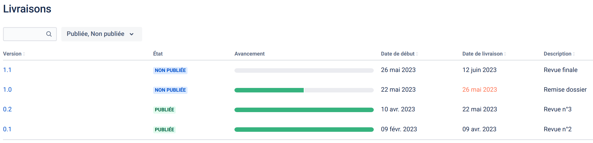

### 0.2


- Android :

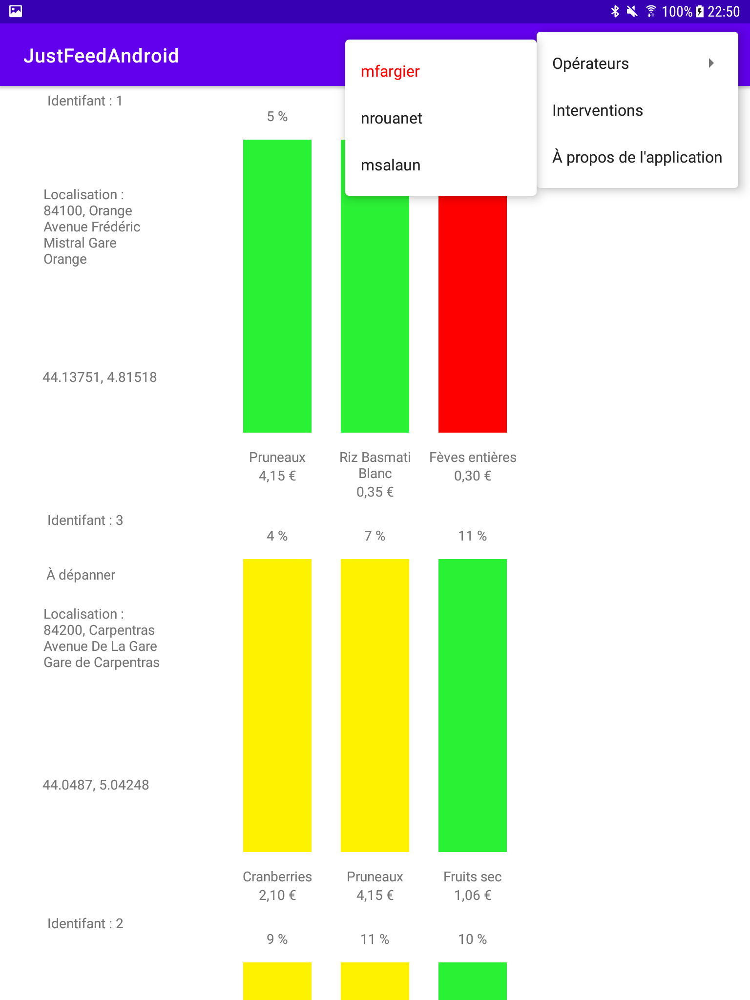

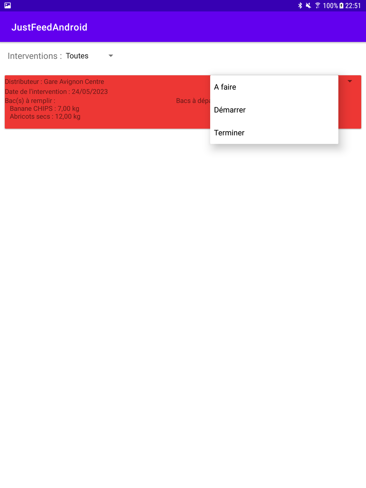

- PC Desktop Qt :

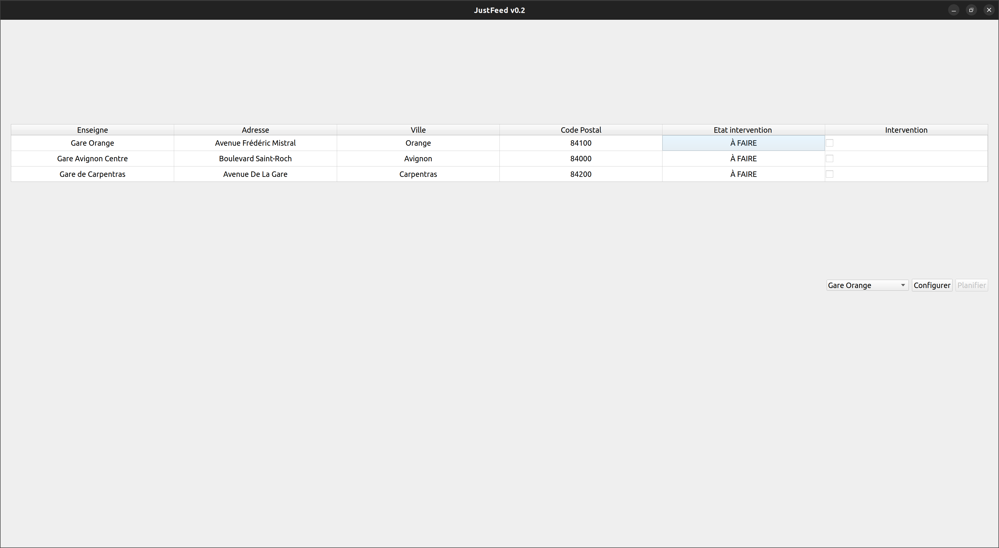

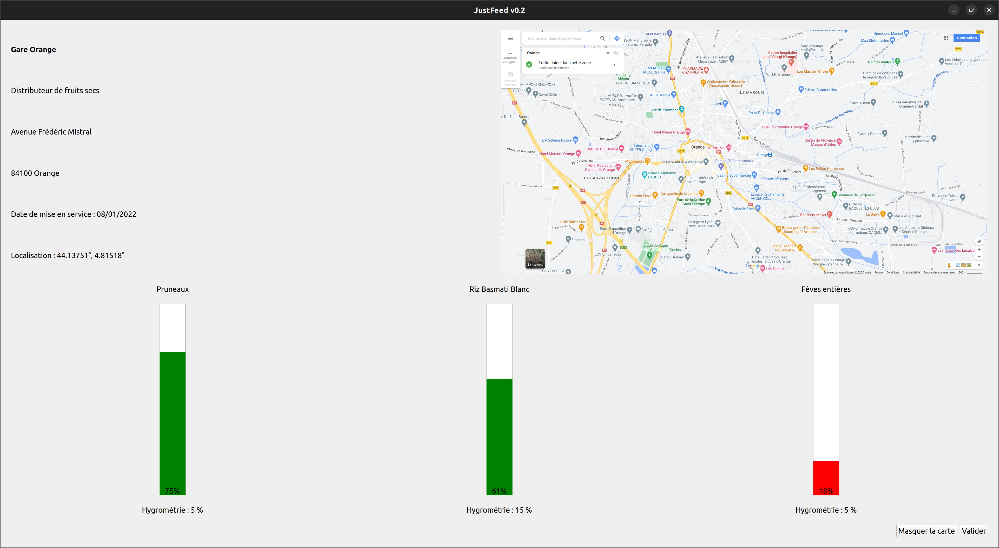

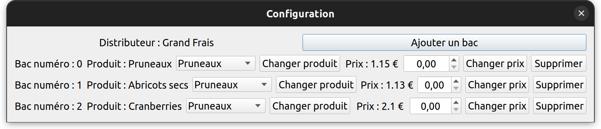

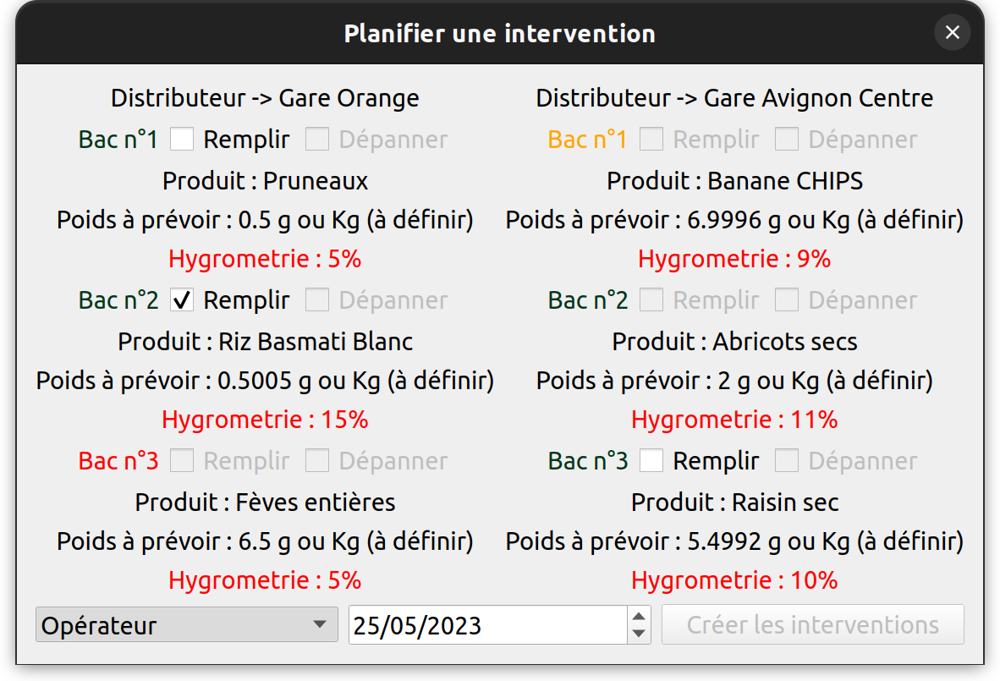

### 0.1

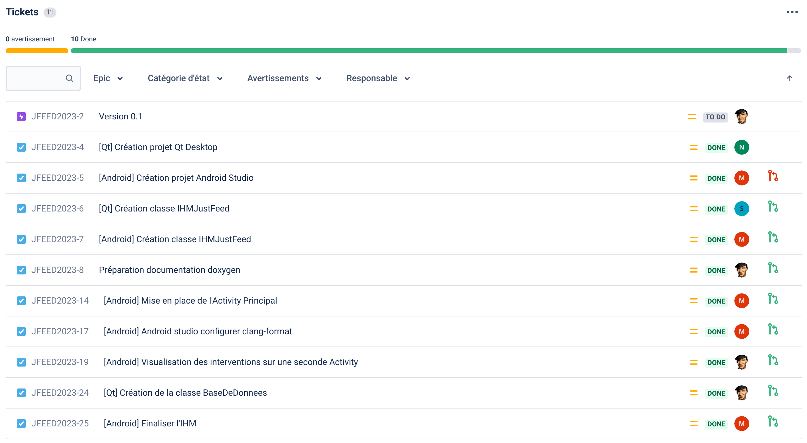

- Android :


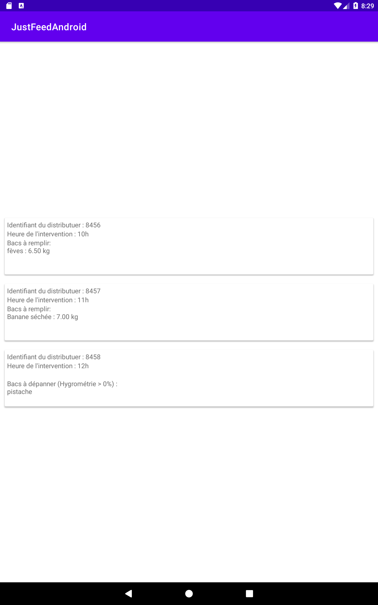

- PC Desktop Qt :

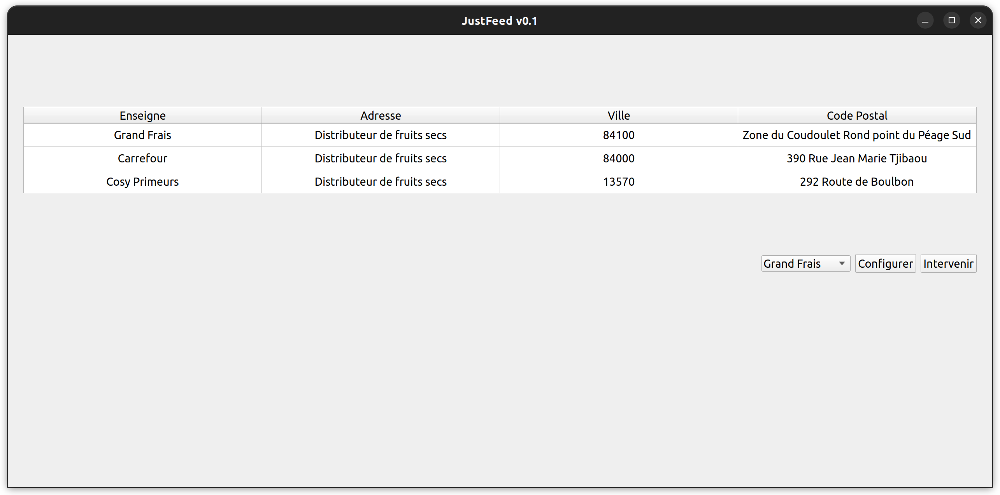


## Auteurs

Étudiants IR :

- Matthieu SALAUN <matthieusalaun30@gmail.com>
- Nicolas ROUANET
- Mayeul FARGIER

---
©️ LaSalle Avignon 2023
